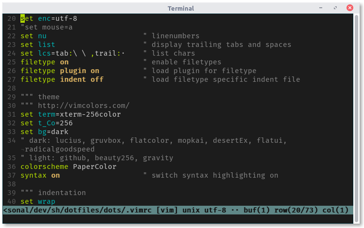
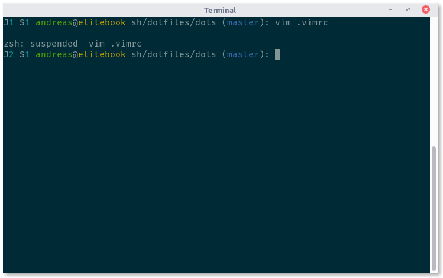
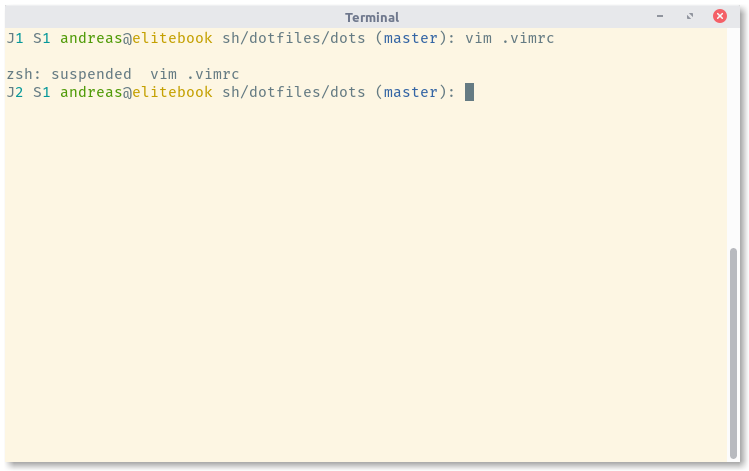

# klingt.net's dotfiles





## Prompt Features

- subshell level if > 0
- number of background jobs if > 0
- return code if non zero
- root username is red
- git branch (zsh only)
- works with light and dark shell color themes

## Try

```sh
$ make run
```

- requires docker
- spins up a small alpine linux container

## Install

```sh
$ make install
```
