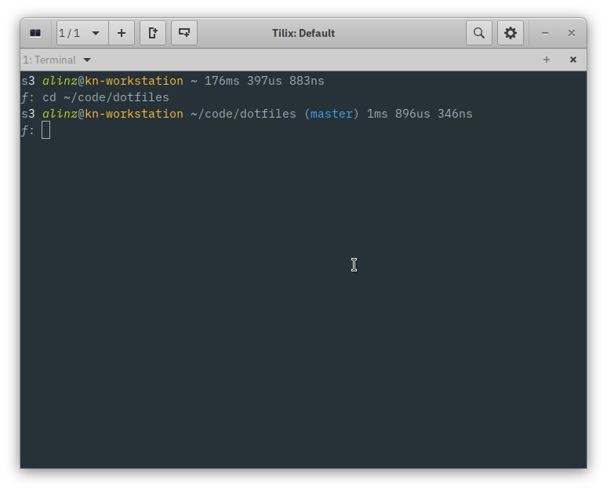

# klingt.net's dotfiles

The latest edition of my dotfiles.
This time I tried to make the prompt as minimal as possible without omitting relevant informations.
Both prompts, bash and zsh are looking identical, except that there is no version control prompt for bash.
I'm also using defaults wherever possible, so customization is really easy.

[Try](#try) it yourself: `make try` (requires docker)



## Prompt Features

- subshell level if > 0
- number of background jobs if > 0
- return code if non zero
- root username is red
- git branch/rebase,merge etc.
- duration of the last command
- since the prompt is generated by a small Rust program it's shell agnostic!

## Try

```sh
$ make try
```

- requires docker
- spins up a small alpine linux container

## Install

**WARNING** The installation will overwrite your original *dots* without confirmation!

```sh
$ make install
```

This also install rusty-prompt which requires the following build dependencies (for Raspbian/Ubuntu):

- cmake
- libssl-dev
- libssh2-1-dev

They can be named differently depending on your Linux distribution.

The repository also contains a small program that generates the output for xfce4's genmon panel plugin and requires `go` to build.

## Customize

You can create a patch file of your custom dotfile settings:

```sh
$ ./patch.sh create
```

The install script will check if the patch file exists and apply them after a successful installation.
You can also apply them manually by running: `./patch.sh apply`.

## Notes

Wayland doesn't respect `.profile` files which means that `.desktop` applications do not inherit the environment variables set there.
I wondered why Visual Studio Code could not find my `GOPATH` and created the following file as a workaround:

```sh
$ cat /usr/share/gdm/env.d/gopath.env
# This is a fix for wayland ignoring `.profile`
# https://bugzilla.gnome.org/show_bug.cgi?id=736660
GOPATH=$HOME/.go
```
